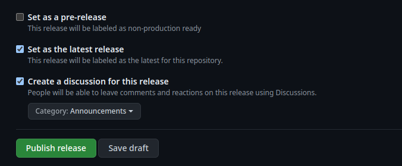

# How to make a new release

Go to the repo root, and check that you don't have any dirty changes and that you are on the main branch.

```bash
git checkout main
git pull
git status
```

If all looks okay, you can create a tag and push it.

Example:

```bash
TAG=v1.2.3
git tag $TAG
git push origin $TAG 
```

Next, go to the github repo and find the workflow [Release DRE binary](https://github.com/dfinity/dre/actions/workflows/dre-release.yaml). You should find the tag you pushed at the top. After it finishes two things will happen:

1. A new PR will be created (like [this one](https://github.com/dfinity/dre/pull/1204)) that contains updated files. 
2. A new [Draft release](https://github.com/dfinity/dre/releases) will be created with the name you set as the tag.

If there are any issues with the PR, resolve that first, request approvals, and merge the changes. 

Only after merging the PR should you find your draft release in [GH releases page](https://github.com/dfinity/dre/releases).
You will also have a link on the PR that contains the link to the exact release. Review the release notes and make changes if needed.

Set the `latest` to point to this new release by unselecting `Set as a pre-release` and selecting `Set as the latest release`. Create a new discussion for the release, and finally click `Publish release`.



Celebrate!
