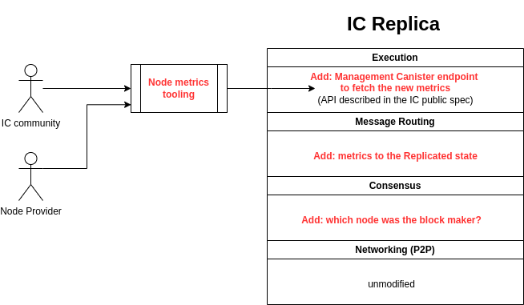

# Trustworthy Node Metrics: Architectural Overview and Design

## Introduction

This document offers a deeper look at the architectural design of the Trustworthy Node Metrics feature on the Internet Computer (IC). It is tailored for IC stakeholders and technical professionals, providing a detailed understanding of both the functional and structural aspects.

## Objectives

The primary goal is to provide clear visibility into the useful work carried out by nodes on the IC. This transparency is a foundational step towards a future feature that will enable the adjustment of node remuneration based on their operational performance and reliability.

## High-Level Architectural Changes

On a high level, planned architectural changes are illustrated in the following figure:

### Integration with Existing Architecture

The feature is designed to integrate seamlessly with the existing IC infrastructure. The changes primarily involve the Consensus Layer, Message Routing Layer, and the addition of new components to handle metric aggregation and retrieval.

### Expose already existing information to end users

Consensus Layer to expose block maker information, which will be collected and aggregated by the Message Routing Layer, and stored in the replicated state with success and failure metrics of nodes.
- The metrics for the number of successfully proposed blocks and failures thereof are accumulated in the replicated state for node IDs. 
- The state of this accumulation is saved as a snapshot including the last batch just before midnight in a queue of snapshots (in chronologically ascending order).
- Snapshots in the queue are immutable, i.e. the current state is not included.
- There is no guarantee that the snapshots represent whole days or that all days are included since the subnet could have been offline at some point. 

### Data Accessibility
The inclusion of new components to ensure that the metrics are easily accessible for analysis and decision-making processes. This involves the management canister playing a crucial role in fetching and providing these metrics to stakeholders.

- A metrics-fetching function is added to the management canister

  - There is support for querying since particular date

  - The function will return data from the replicated state.

  - See https://github.com/dfinity/interface-spec/pull/215 for more details.

The DRE team provided open source tooling that fetches the metrics from the management canister(s) of all subnets and allows the community members to inspect the metrics in details.

- The metrics retrieved from the IC can be stored in a local file (JSON format), and then further analyzed

- The metrics will be retrieved from all subnets in parallel, whenever possible, to reduce the amount of time needed to fetch them, taking into account the possible increase of the number of subnets in the future.

- See [trustworth-metrics](./trustworth-metrics.md)

## Detailed Architectural Diagrams and Data Flow

The high-level and in-depth technical diagrams provide a visual representation of the data flow within the IC architecture with to the implementation of the Trustworthy Node Metrics feature.

[](https://mermaid.live/edit#pako:eNqtlFFv2jAQx7_KyU8gQSWSNzRVotCqoMEqQKNrwoNJLonVxEa2M8pKv3vPoYMwqa2K5pdYd3__7-4Xy88sUjGyLks1X2cwH4QSaJlytQ-EbNiHviqKUgq7Ddk-7dZNELJDAsZYrFCbMJTBb9Qi2UKBVovILEO2hHb7ch4MptcwVyoXMl3WbFwSboMBtxx6kudbI0ylMzXVbaUaBaPZjwnETroRNjvWOAhHlXAYHDsbSiPSzAKXMfx0rYmIW6EkqAQmNDvcoU6ULriM8M0IZfwPhtlTUJGggEQL9zTUseYcvrXbruziGFsEC57nJO1zKYxFXdMvSH9x0b7cJWijrBpnB4POUdDrUP_SoDSlge98S6fdWLvrp7UyaGCVq-gRCv6IGoSsmncT7eCqQ22O0RieIkxVaYk1NMbT5t7lpOurTuXZS1ONKbdk6whttKDtDvqdRqMxxXXuaGEMM0ufZrN5PD_oBGMuqVCBsjZmZTrXpbEbpW12uAfQuxs623cJb08I_zrpdU_MIQvZzQFadQfoxkVaGdN-O9i4n6BtQkT0TciIq1fj6p3L1fsCV-9Drt6nXL1zuHrvcv1zwvXhv3H1a1z9c7n6X-Dqf8jV_5Srfw5Xv8aVtViB1LuI6b18domQ2Yz8QtalbYwJL3Pr3sgXkvLSqtlWRqxrdYktVq6JLQ4Ep_9SsG7Cc0NRjIVVerx_g6unuMXWXD4o9Vfz8gpvRMv6)

## Changes in the Public Specification

Addition of the `node_metrics` Interface: This involves updating the existing public spec to include a new `node_metrics` interface that will provide detailed metrics about node performance.

This new interface is marked as experimental, which means that end users should not count on it being permanently being present without changes.

## Security and Reliability Considerations

The feature requires the use of a wallet canister, in order to prevent abuse. Each request for fetching metrics will be charged for, which makes it harder for malicious users to conduct DOS attacks using this interface.

All data is retrieved through `update` calls, in order to prevent a potentially malicious node from providing false data.

## Conclusion

The Trustworthy Node Metrics feature enables the next milestone in the transparency and operational efficiency of the IC. By providing clear insights into node performance, it lays the groundwork for decentralized data-driven decision making, and for future enhancements in node remuneration processes.
