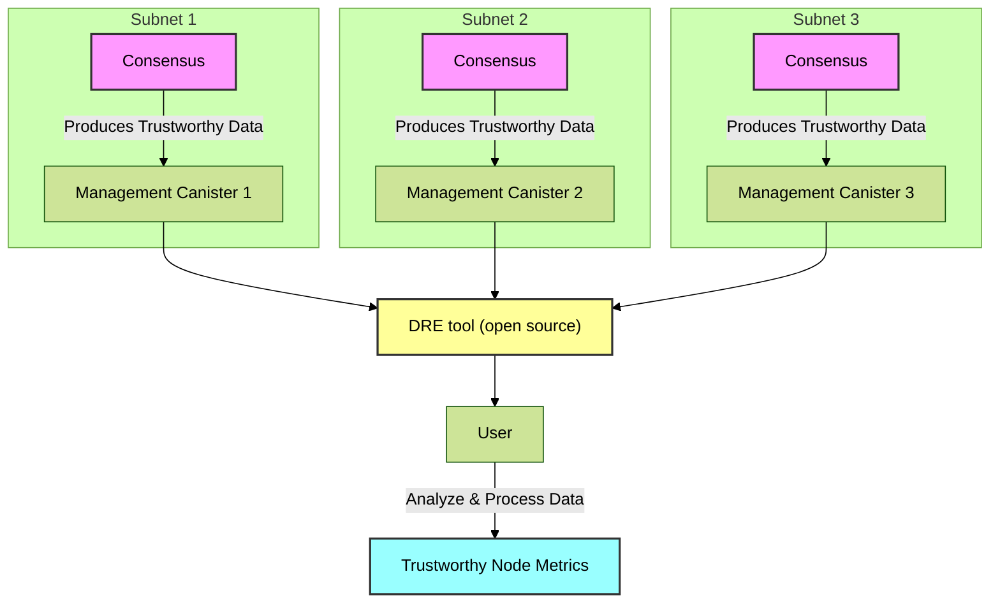

# Get trustworthy metrics from the IC Mainnet

## Introduction

Trustworthy Node Metrics provide greater visibility into node performance, in a trustworthy manner. Trustworthy here means that the metrics are generated and served by the IC itself, without an intermediary, and without a possibility that any single node can fake their health status.

Medium term objective is to use these metrics to adjust node rewards based on the contributions of individual nodes to the core IC protocol. For this purpose, we currently expose the metric on how many block rounds a particular node was, or was not, contributing to the protocol. In each round, the *block maker* node is [selected based on the random beacon](https://eprint.iacr.org/2022/087.pdf). In order for the node to "make a block", it needs to be up to date, so must have sufficient network connectivity, and it must be fast enough, so the compute and storage resources must be sufficient for it. This makes the block maker a good metric for the node contributions to the protocol.

The information that all nodes in the subnet have about who is the block maker, and who failed to be the block maker, was already stored in the consensus. We know exposed it to the public through the subnet's replicated state and the management canister. Since this information comes from the consensus, it can be considered to be trustworthy.

Note that IC is split into subnets, and each subnet has its own consensus, replicated state, and management canister. We developed and open sourced tooling that fetches trustworthy metrics from all subnets, joins it together, and provides it to the IC community for analysis and inspection.

This entire process is shown in the following diagram:



## Prerequisites

To be able to fetch trustworthy metrics, a couple of things are currently needed. While we are looking for ways to simplify the process, for security reasons at the moment one still needs to use wallet canister and fetch metrics with update calls, and these update calls go through the consensus as well and need to be paid for. Hence the requirement for the wallet canister.

??? tip "Click here to learn how to create a wallet canister, if you don't have one already"

    1. You need a dfx principal. If needed you can create a new one with

        ```bash
        # You can use the one from your HSM but there are some caveats to that that will be addressed later
        dfx identity new <identity-name>
        ```

        or follow instructions from the [IC SDK Docs](https://internetcomputer.org/docs/current/developer-docs/setup/cycles/cycles-wallet/#creating-a-cycles-wallet-on-the-mainnet)

    2. You can list available dfx identities with `dfx identity list` and then need to select that identity and get its principal.

        ```bash
        dfx identity use <dfx-identity-name>
        dfx identity get-principal
        ```

    3. Check the current balance for the principal

        ```bash
        dfx ledger --network ic balance
        ```

        If you have less than 2 Trillion Cycles (TC) worth of ICP, based on the [current ICP value](https://www.coinbase.com/converter/icp/xdr), you can top up the ICP balance by sending funds to the principal, e.g., from [https://ic0.app/wallet/](https://ic0.app/wallet/).

        1 TC corresponds to 1 XDR at the time of conversion. XDR is the currency symbol of the IMF SDR, a basket of five fiat currencies, corresponding to 1.33 U.S. dollar at the time of writing. Canister creation itself will cost 1 TC, and you will need some cycles more to execute commands.

    4. Create the wallet canister, after that you will get the wallet canister id in the output.

        ```bash
        dfx ledger --network ic create-canister --amount 0.5 <principal-from-step-2>
        ```

        You may need to adjust the amount of ICPs if needed, based on the current ICP value. More info can be found in the [IC SDK Docs](https://internetcomputer.org/docs/current/references/cli-reference/dfx-ledger/#options).

    5. Deploy the wallet canister code

        ```bash
        dfx identity --network ic deploy-wallet <wallet-canister-id-from-step-4>
        ```


### Using the cli

You can obtain the DRE tool by following the instructions from [getting started](../getting-started.md)

To test out the command you can run the following command

```bash
dre <auth-params> trustworthy-metrics <wallet-canister-id> <start-at-timestamp> [<subnet-id>...]
```

??? tip "Explanation of the arguments"

    1. `auth-params` - depending on which identity you used to deploy the wallet canister you have two options:
    2. `wallet-canister-id` - id of the created wallet canister created in the step 4 above, or obtained by
    ```bash
        dfx identity --network ic get-wallet
        ```
    3. `start-at-timestamp` - used for filtering the output. To get all metrics, provide 0
    4. `subnet-id` - subnets to query, if empty will provide metrics for all subnets


#### Authentication

Both authentication with a private key, and with an HSM are supported.
Authentication with a private key is recommended, since it allows for more parallelism.

??? tip "Click here to see how to export a private key with `dfx`"

    1. export identity as a `.pem` file:

        ```bash
        dfx identity export <identity-name> > identity.pem
        ```

    2. replace `<key-params>` in the command with something like: `--private-key-pem identity.pem`

??? tip "Click here to see how to authenticate with an HSM"

    Replace `<key-params>` with: `--hsm-slot 0 --hsm-key-id 0 --hsm-pin <pin>`. Note that the HSM operations are slower than the key file due to hardware limits, so getting metrics with an HSM will be a bit slower.

??? tip "Click here to see how to add multiple controllers to the wallet canister"

    There are many reasons why this can be useful. For instance, allowing more team members to use the same wallet canister, or adding a private-key based controller in addition to an HSM, etc.

    1. Get the principal of new identity

        ```bash
        dfx identity use <identity-name> && dfx identity get-principal
        ```

    2. Add the identity as the controller of canister

        ```bash
        dfx identity use <identity-name-used-for-creating-canister>
        dfx wallet --network ic add-controller <principal>
        ```

    And that's it! From now on, you can use the second identity while running the tool.

# Example use

Here are some real-world examples of how metrics can be retrieved:

```bash
dre --private-key-pem identity.pem trustworthy-metrics nanx4-baaaa-aaaap-qb4sq-cai 0 > data.json
```

Or with an HSM:
```bash
dre --hsm-slot 0 --hsm-key-id 0 --hsm-pin "<pin>" trustworthy-metrics nanx4-baaaa-aaaap-qb4sq-cai 0 > data.json
```

You can check some examples of the analytics possible with the IC Mainnet data in the following [Jupyter Notebook](./TrustworthyMetricsAnalytics.ipynb)

If you don't have Jupyter notebooks locally, you can use [Google Colaboratory](https://colab.research.google.com/github/dfinity/dre/blob/main/docs/trustworthy-metrics/TrustworthyMetricsAnalytics.ipynb) or [](https://mybinder.org/v2/gh/dfinity/dre/main?labpath=docs%2Ftrustworthy-metrics%2FTrustworthyMetricsAnalytics.ipynb) to run it online for free.
