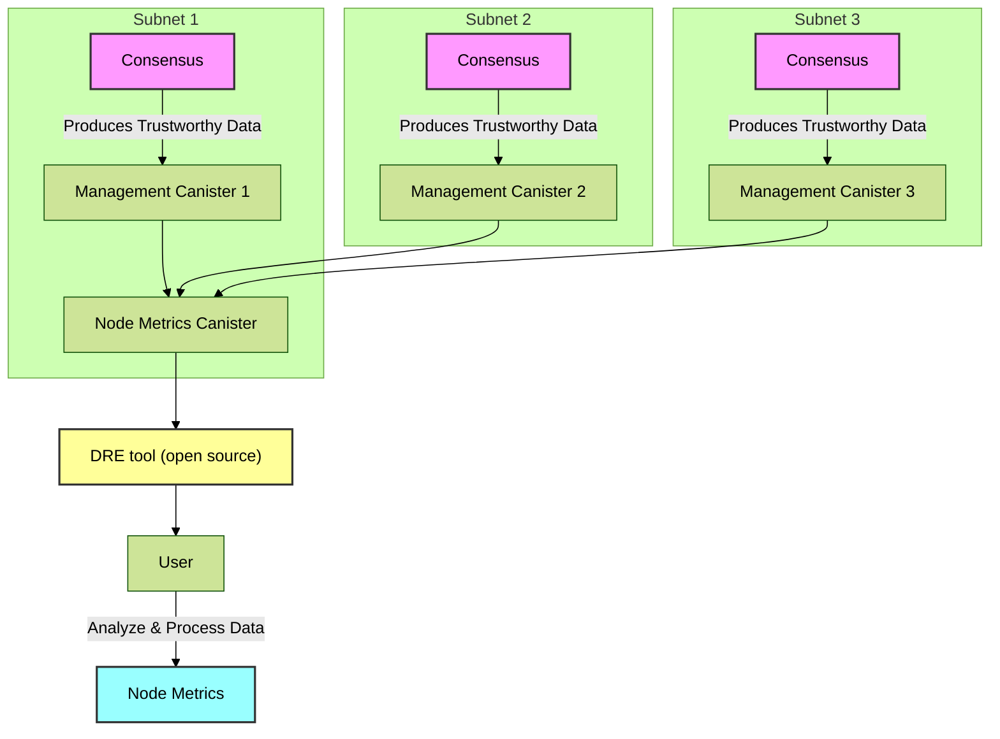

# Get untrusted metrics from Node Metrics canister

## Introduction

Untrusted Node Metrics retrieval offers an alternative approach to accessing node performance data, relying on a canister that collects these metrics instead of quering the management canister of each subnet directly.

This method allows users to fetch node metrics dating back to May 18, 2024, providing an historical view compared to the trustworthy method, which only offers data from the past month.

The key drawback of quering untrusted metrics is that it introduces an intermediary, the canister responsible for data aggregation, which should NOT be considered trustworthy.

Despite these concerns, the extended temporal coverage can be valuable for certain analytical purposes. Additionally, querying the node metrics canister is cheaper because it allows for a query call instead of an update call and does not require a wallet canister.

This entire process is shown in the following diagram:



### Using the cli

You can obtain the DRE tool by following the instructions from [getting started](../getting-started.md)

To test out the command you can run the following command

```bash
dre node-metrics from metrics-canister <start-at-timestamp> [<subnet-id>...]
```

??? tip "Explanation of the arguments"
    3. `start-at-timestamp` - used for filtering the output. To get all metrics, provide 0
    4. `subnet-id` - subnets to query, if empty will provide metrics for all subnets

# Example use

Here are some real-world examples of how metrics can be retrieved:

```bash
dre node-metrics from metrics-canister 0 > data.json
```
